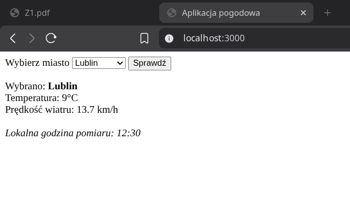
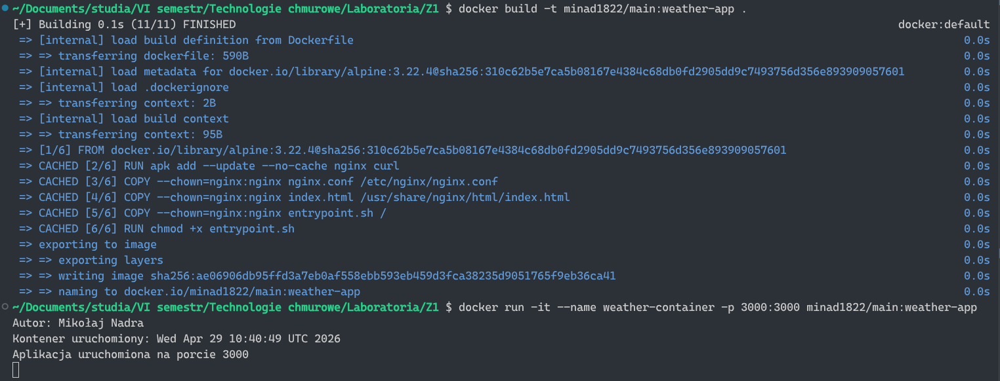
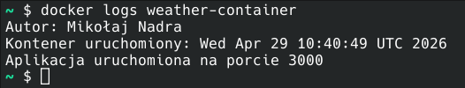
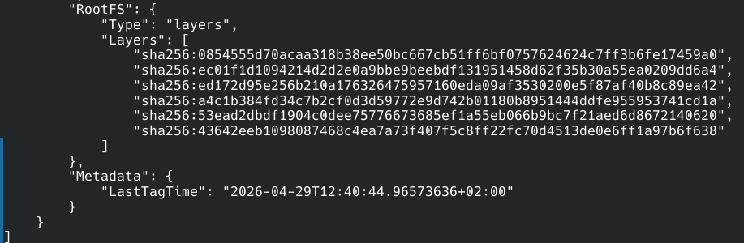

# Mikołaj Nadra TI 6.2 - Zadanie 1

Opis części obowiązkowej



### Zbudowanie obrazu

```bash
docker build -t minad1822/main:weather-app .
```

### Uruchomienie konteneru

```bash
docker run -it --name weather-container -p 3000:3000 minad1822/main:weather-app
```



### Sprawdzanie logów
```bash
docker logs weather-container
```



### Liczba warstw - 6
```bash
docker inspect
```



### Rozmiar obrazu - 15.5 MB 
```bash
docker images
```

