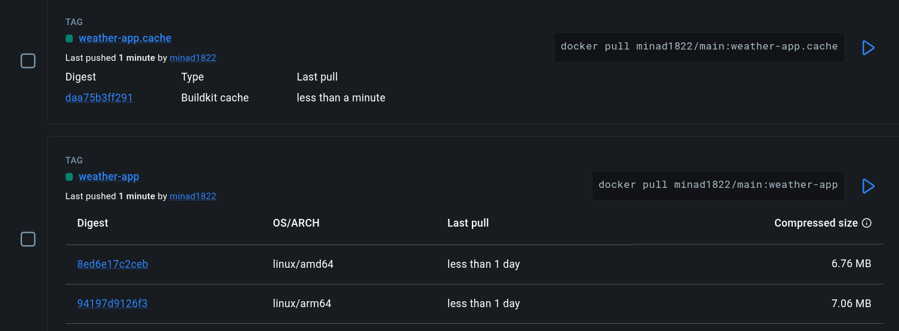
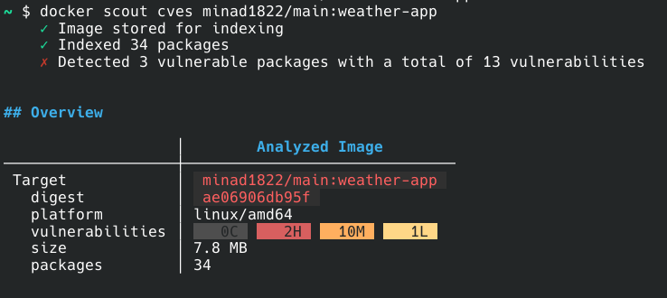

# Mikołaj Nadra TI 6.2 - Zadanie 1

Opis części dodatkowej

### Zbudowanie obrazu

```bash
docker buildx build --ssh github=$HOME/.ssh/gh4_labpl \
-t minad1822/main:weather-app --platform linux/amd64,linux/arm64 \
--cache-from type=registry,ref=minad1822/main:weather-app.cache \
--cache-to type=registry,ref=minad1822/main:weather-app.cache,mode=max --push .
```

### Zmieniony obraz posiada 5 warstw

### Rozmiar cache - 30 MB




Zbudowany obraz posiada 2 podatności oznaczone jako HIGH. Znajdują się one w pakietach curl oraz nghttp2. Docker Scout nie znalazł wersji tych pakietów bez podatności. 

